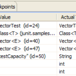

下面是一个免费的全球IP地址数据库，包括了国家，城市，地区，和经纬度，以便你可以利用Google Map在地图上标注。这个数据库的精确度可能有60%左右。

[**SQL format**](http://www.blogama.org/ipinfodb.sql.bz2)  

更新至 2009年3月11日

[**CSV format**](http://www.blogama.org/ipinfodb_csv.zip) (多文件)  

更新至 2009年3月11日

下面是怎么使用这个数据库。

首先，所有的IP地址都是按一个整形来存放的，假设一个IP地址为A.B.C.D，那么其计算公式如下所示：

ip = (A\*256+B)\*256+C

也就是说，它只计算到网段为：A.B.C.0到A.B.C.255。例如：我们有一个IP地址为：74.125.45.100 (google.com)，那么，

ip = (74\*256+125)\*256+45 = 4881709

这样，我们可以方便地使用如下的SQL语句搜索数据：

SELECT \* FROM `ip_group_city`  

WHERE`ip_start` <= 4881709 ORDER BY ip\_start DESC LIMIT 1;

结果会是如下所示：

ip\_start|country\_code|region\_code|city|zipcode|latitude|longitude  

4881664|US|CA|Mountain View|94043|37.4192|-122.057

如果你想在线使用这些数据的话，你可以使用如下所示的网址：

http://blogama.org/ip\_query.php?ip=74.125.45.100&output=xml

于是，你就会得到如下的XML数据：

<?xml version=“1.0” encoding=“UTF-8”?>  

<Response>  

<Ip>74.125.45.100</Ip>  

<Status>OK</Status>  

<CountryCode>US</CountryCode>  

<CountryName>United States</CountryName>  

<RegionCode>CA</RegionCode>  

   

<RegionName></RegionName>  

<City>Mountain View</City>  

<ZipPostalCode>94043</ZipPostalCode>  

<Latitude>37.4192</Latitude>  

<Longitude>-122.057</Longitude>  

</Response>

如果你请求的是：

<http://blogama.org/ip_query.php?ip=74.125.45.100&output=raw>

这样你会得到CSV的格式：

74.125.45.100,OK,US,United States,CA,,Mountain View,94043,37.4192,-122.057

文章：[来源](http://blogama.org/node/58)

**（转载本站文章请注明作者和出处 [酷 壳 – CoolShell](https://coolshell.cn/) ，请勿用于任何商业用途）**

### 相关文章

* [https://coolshell.cn/wp-content/plugins/wordpress-23-related-posts-plugin/static/thumbs/8.jpg](https://coolshell.cn/articles/2631.html)[五大基于JVM的脚本语言](https://coolshell.cn/articles/2631.html)
* [Eclipse 3.6 （Helios）新特性](https://coolshell.cn/articles/2554.html)
* [https://coolshell.cn/wp-content/plugins/wordpress-23-related-posts-plugin/static/thumbs/12.jpg](https://coolshell.cn/articles/688.html)[你能做对下面这些JavaScript的题吗？](https://coolshell.cn/articles/688.html)
* [https://coolshell.cn/wp-content/plugins/wordpress-23-related-posts-plugin/static/thumbs/17.jpg](https://coolshell.cn/articles/1023.html)[Unix 40年：昨天，今天和明天](https://coolshell.cn/articles/1023.html)
* [https://coolshell.cn/wp-content/plugins/wordpress-23-related-posts-plugin/static/thumbs/8.jpg](https://coolshell.cn/articles/8745.html)[如此理解面向对象编程](https://coolshell.cn/articles/8745.html)
* [伦敦地铁实时图](https://coolshell.cn/articles/2520.html)
The post [全球IP地址数据库](https://coolshell.cn/articles/244.html) first appeared on [酷 壳 - CoolShell](https://coolshell.cn).