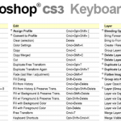

下面是一些非常不错的编程教程，当然，全是英文版的。不过因为是新手教程，所以非常容易阅读，可以在学习技术的同时加强一下自己的英语阅读能力。

如果你是一个新手，建议你把本页设为你的收藏夹。  

**C**   

[Introduction to C Programming](http://devcentral.iftech.com/learning/tutorials/c-cpp/c/)   

[C Optimization Tutorial](http://www.abarnett.demon.co.uk/tutorial.html)   

[Compiling C and C++ Programs on UNIX Systems – gcc/g++](http://www.actcom.co.il/~choo/lupg/tutorials/c-on-unix/c-on-unix.html)   

[Building and Using Static and Shared C Libraries](http://www.actcom.co.il/~choo/lupg/tutorials/libraries/unix-c-librarieshtml)   

[Programming in C: UNIX System Calls and Subroutines Using C](http://www.cm.cf.ac.uk/Dave/C/CE.html)   

[C FAQ](http://www.eskimo.com/~scs/C-faq/top.html)   

[C Programming Class Notes](http://www.eskimo.com/~scs/cclass/cclass.html)   

[ANSI C for Programmers on UNIX Systems](http://www.gustavo.net/programming/c__tutorials.shtml)   

[Sams Teach Yourself C in 24 Hours](http://www.informit.com/product/0672310686/)   

[Sams Teach Yourself C in 21 Days (4th Ed.)](http://www.informit.com/product/0672310694/)   

[The Standard C Library for Linux – Part 1: file functions](http://www.linuxgazette.com/issue24/rogers.html)   

[The Standard C Library for Linux – Part 2: character input/output](http://www.linuxgazette.com/issue31/rogers1.html)   

[The Standard C Library for Linux – Part 3: formatted input/output](http://www.linuxgazette.com/issue32/rogers.html)   

[The Standard C Library for Linux – Part 4: Character Handling](http://www.linuxgazette.com/issue38/rogers.html)   

[The Standard C Library for Linux – Part 5: Miscellaneous Functions](http://www.linuxgazette.com/issue39/rogers.html)   

[Programming in C: A Tutorial](http://www.lysator.liu.se/c/bwk-tutor.html)   

[An Introduction to C Development on Linux](http://www.redhat.com/devnet/whitepapers/intro_dev/index.html)   

[C Programming Course](http://www.strath.ac.uk/CC/Courses/CCourse/CCourse.html)   

[C Language Tutorial](http://www.swcp.com/~dodrill/cdoc/clist.htm)   

[CScene: An Online Magazine for C and C++ Programming](http://www.syclus.com/cscene/)   

  

**C++**   

[C++ Tutorial](http://computers.iwz.com/prog/cpp/)   

[Understanding C++: An Accelerated Introduction](http://devcentral.iftech.com/learning/tutorials/c-cpp/cpp/)   

[An Introduction to C++ Class Hierarchies](http://devcentral.iftech.com/learning/tutorials/c-cpp/sst/)   

[G++ FAQ](http://egcs.cygnus.com/onlinedocs/g++FAQ_toc.html)   

[Introduction to Object-Oriented Programming Using C++](http://uu-gna.mit.edu:8001/uu-gn/atext/cc/)   

[Compiling C and C++ Programs on UNIX Systems – gcc/g++](http://www.actcom.co.il/~choo/lupg/tutorials/c-on-unix/c-on-unix.html)   

[C++ FAQ Lite](http://www.cerfnet.com/~mpcline/c++-faq-lite/)   

[C++ Programming Language Tutorials](http://www.cs.wustl.edu/~schmidt/C++/index.html)   

[Reducing Dependencies in C++](http://www.flipcode.com/tutorials/tut_cppdepend.shtml)   

[C++ Exception Handling](http://www.flipcode.com/tutorials/tut_exceptions.shtml)   

[Part 1: Unicode](http://www.flipcode.com/tutorials/tut_strings01.shtml)   

[Part 2: A Complete String Class](http://www.flipcode.com/tutorials/tut_strings02.shtml)   

[Making C++ Loadable Modules Work](http://www.informatik.uni-frankfurt.de/~fp/Tcl/tcl-c++/)   

[Sams Teach Yourself C++ in 21 Days (2nd Ed.)](http://www.informit.com/product/0672310708/)   

[C++ Portability Guide](http://www.mozilla.org/hacking/portable-cpp.html)   

[C++ Tips](http://www.ses.com/~clarke/cpptips.html)   

[C++ Language Tutorial](http://www.swcp.com/~dodrill/cppdoc/cpplist.htm)   

[CScene: An Online Magazine for C and C++ Programming](http://www.syclus.com/cscene/)   

[C++ Libraries FAQ](http://www.trumphurst.com/cpplibs1.html) 

**CGI**   

[CGI Programming Tutorial](http://www.acm.vt.edu/~scott/cgi.html)   

[CGI Programming 101](http://www.cgi101.com/class/)   

[CGI Manual of Style](http://www.informit.com/product/1562763970/)   

[CGI Developer’s Guide](http://www.informit.com/product/1575210878/)   

[CGI Programming Unleashed](http://www.informit.com/product/1575211513/)   

[Sams Teach Yourself CGI Programming with Perl 5 in a Week (2nd Ed.)](http://www.informit.com/product/1575211963/)   

[CGI/Perl Tips, Tricks and Hints](http://www.speakeasy.org/~cgires/cgi-tips.html)   

[A Tour of HTML Forms and CGI Scripts](http://www.speakeasy.org/~cgires/cgi-tour.html)   

[Reading CGI Data: URL-Encoding and the CGI Protocol](http://www.speakeasy.org/~cgires/readdat/aindex.html)   

[CGI Programming FAQ](http://www.webthing.com/tutorials/cgifaq.html) 

**CORBA**   

[CORBA FAQ](http://www.cerfnet.com/~mpcline/corba-faq/)   

[A Brief Tutorial on CORBA](http://www.cs.indiana.edu/hyplan/kksiazek/tuto.html)   

[CORBA 2.0 Specification](http://www.cs.wustl.edu/~schmidt/CORBA-docs/index.html)   

[CORBA Tutorials](http://www.cs.wustl.edu/~schmidt/tutorials-corba.html)   

[Sams Teach Yourself CORBA in 14 Days](http://www.informit.com/product/0672312085/)   

[Linux Network Programming, Part 3 – CORBA: The Software Bus](http://www2.linuxjournal.com/lj-issues/issue48/2336.html)   

[CORBA Program Development, Part 1](http://www2.linuxjournal.com/lj-issues/issue61/3201.html)   

[CORBA Program Development, Part 2](http://www2.linuxjournal.com/lj-issues/issue62/3213.html)   

[CORBA Program Development, Part 3](http://www2.linuxjournal.com/lj-issues/issue63/3214.html) 

**CSS**   

[CSS2 Tutorial](http://richinstyle.com/guides/css2.html) 

**CVS**   

[CVS Tutorial](http://cellworks.washington.edu/pub/docs/cvs/tutorial/cvs_tutorial_toc.html)   

[Concurrent Version System Tutorial](http://www.csc.calpoly.edu/~dbutler/tutorials/winter96/cvs/) 

**DHTML**   

[Introduction to Dynamic HTML](http://www.stars.com/Authoring/DHTML/Intro/) 

**Emacs**   

[Emacs: The Software Engineer’s  Army Knife”](http://heather.cs.ucdavis.edu/~matloff/UnixAndC/Editors/Emacs.html)   

[Emacs FAQ](http://www.geek-girl.com/emacs/faq/index.html)   

[GNU Emacs Lisp Reference Manual](http://www.gnu.org/manual/elisp-manual-20-2.5/elisp.html)   

[Programming in Emacs Lisp](http://www.gnu.org/manual/emacs-lisp-intro/emacs-lisp-intro.html)   

[GNU Emacs Manual](http://www.gprep.pvt.k12.md.us/technology/emacs_lesson/emacs_toc.html)   

[A Tutorial Introduction to Emacs](http://www.lib.uchicago.edu/keith/tcl-course/emacs-tutorial.html)   

[EMACSulation: Internet-ready!](http://www.linuxgazette.com/issue26/marsden.html)   

[EMACSulation: Ediff – An Emacs interface to diff and patch](http://www.linuxgazette.com/issue27/marsden.html)   

[EMACSulation: Emacs as a Server](http://www.linuxgazette.com/issue29/marsden.html)   

[EMACSulation: Customizing Emacs](http://www.linuxgazette.com/issue31/marsden.html)   

[Basic Emacs](http://www.linuxgazette.com/issue35/anderson.html)   

[EMACSulation: Templating Mechanisms](http://www.linuxgazette.com/issue39/marsden.html)   

[Emacs Macros and the Power-Macros Package](http://www.linuxgazette.com/issue47/pedersen.html)   

[Polyglot Emacs 20.4](http://www2.linuxjournal.com/lj-issues/issue59/2178.html) 

**Expect**   

[Advanced Programming in Expect: A Bulletproof Interface](http://www.linuxgazette.com/issue48/fisher.html)   

[Automating Tasks with Expect](http://www2.linuxjournal.com/lj-issues/issue54/3065.html)   

[What Can you Expect?–A Data Collection Project Using Linux](http://www2.linuxjournal.com/lj-issues/issue68/3357.html) 

**Fortran**   

[Professional Programmer’s Guide to Fortran 77](ftp://ftp.star.le.ac.uk/pub/fortran/)   

[Fortran 90 and Computational Science](http://csep1.phy.ornl.gov/pl/pl.html)   

[User Notes on Fortran Programming](http://metalab.unc.edu/pub/languages/fortran/unfp.html)   

[Fortran Programming for Physics and Astronomy](http://noether.vassar.edu/~myers/Fortran.html)   

[A Fortran 90 Tutorial](http://www.astro.unibas.ch/F90Tutorial/tutorial.html)   

[Using GNU Fortran](http://www.delorie.com/gnu/docs/g77/g77_1.html)   

[Fortran 90: A Course for Fortran 77 Programmers](http://www.hpctec.mcc.ac.uk/hpctec/courses/Fortran90/F90course.html)   

[Fortran 90 for the Fortran 77 Programmer](http://www.nsc.liu.se/f77to90.html)   

[Introduction to Fortran](http://www.stanford.edu/class/sccm001/) 

**GIMP**   

[GIMP Tutorial Index](http://empyrean.lib.ndsu.nodak.edu/~nem/gimp/tuts/)   

[A Tutorial for Perl GIMP Users](http://imagic.weizmann.ac.il/~dov/gimp/perl-tut.html)   

[A Scheme Tutorial for GIMP Users](http://imagic.weizmann.ac.il/~dov/gimp/scheme-tut.html)   

[GIMP Guide](http://jgo.local.net/GimpGuide/)   

[The GIMP User Manual](http://manual.gimp.org/)   

[Pseudo 3-D with GIMP](http://www.linuxfocus.org/English/July2000/article113.shtml)   

[Graphical Photocomposition with GIMP](http://www.linuxfocus.org/English/March1998/article9.html)   

[Creating Text with the GIMP](http://www.linuxfocus.org/English/May1998/article10.html)   

[Creating Fire Effects with the GIMP](http://www.linuxfocus.org/English/November1999/article112.html)   

[Creating and Editing Animations with GIMP](http://www.linuxfocus.org/English/articles/article28.html)   

[GIMP-Perl: GIMP Scripting for the Rest of Us](http://www.linuxgazette.com/issue51/mauerer.html)   

[Writing a GIMP Plugin](http://www.oberlin.edu/~kturner/gimp/doc/)   

[GIMP: The RRU Tutorial](http://www.rru.com/~meo/gimp/Tutorial/)   

[GIMP User FAQ](http://www.rru.com/~meo/gimp/faq-user.html)   

[Script-Fu Tutorial](http://www.soulfry.com/script-fu/index.html)   

[The Quick Start Guide to the GIMP, Part 1](http://www2.linuxjournal.com/lj-issues/issue43/2388.html)   

[The Quick Start Guide to the GIMP, Part 2](http://www2.linuxjournal.com/lj-issues/issue44/2530.html)   

[The Quick Start Guide to the GIMP, Part 3](http://www2.linuxjournal.com/lj-issues/issue45/2531.html)   

[The Quick Start Guide to the GIMP, Part 4](http://www2.linuxjournal.com/lj-issues/issue46/2532.html) 

**GNOME**   

[Application Programming Using the GNOME Libraries](http://developer.gnome.org/doc/tutorials/gnome-libs/)   

[Part 1: Everything You Need to Get Started](http://www-4.ibm.com/software/developer/library/gnome-programming/indexhtml)   

[Part 2: Building a Sample Genealogy Program](http://www-4.ibm.com/software/developer/library/gnome2/)   

[Part 3: Adding File Saving and Loading Using libxml](http://www-4.ibm.com/software/developer/library/gnome3/?dwzone=linux)   

[Creating GTK+ Widgets with GOB: An Easier Way to Derive New GTK+ Widgets](http://www-4.ibm.com/software/developer/library/gnome4/index.html?dwzone=linux)   

[Handling Multipel Documents: Using the GnomeMDI Framework](http://www-4.ibm.com/software/developer/library/gnome5/index.html?dwzone=linux)   

[Livening Things Up: Graphics Made Easy Using the GNOME Canvas](http://www-4.ibm.com/software/developer/library/gnomenclature/index.html?dwzone=linux)   

[Developing Gnome Applications with Python – Part 1](http://www.linuxfocus.org/English/July2000/article160.shtml) 

**GTK**   

[GDK Reference Manual](http://developer.gnome.org/doc/API/gdk/index.html)   

[GLib Reference Manual](http://developer.gnome.org/doc/API/glib/index.html)   

[GTK+ Reference Manual](http://developer.gnome.org/doc/API/gtk/index.html)   

[The GIMP Toolkit](http://www.gtk.org/docs/gtk_toc.html)   

[GTK+ FAQ](http://www.gtk.org/faq/)   

[GTK V1.2 Tutorial](http://www.gtk.org/tutorial/gtk_tut.html)   

[Drawing and Event Handling in GTK](http://www.gtk.org/~otaylor/gtk/tutorial/drawing_tut.html)   

[An Introduction to the GIMP Tool Kit](http://www2.linuxjournal.com/lj-issues/issue47/2465.html) 

**Gnuplot**   

[Constrained Dynamics](http://www-cgi.cs.cmu.edu/afs/cs.cmu.edu/user/baraff/www/pbm/constraints.pdf)   

[Continuum Dynamics](http://www-cgi.cs.cmu.edu/afs/cs.cmu.edu/user/baraff/www/pbm/continuators.pdf)   

[Differential Equation Basics](http://www-cgi.cs.cmu.edu/afs/cs.cmu.edu/user/baraff/www/pbm/diffyq.pdf)   

[Energy Functions and Stiffness](http://www-cgi.cs.cmu.edu/afs/cs.cmu.edu/user/baraff/www/pbm/energons.pdf)   

[Particle System Dynamics](http://www-cgi.cs.cmu.edu/afs/cs.cmu.edu/user/baraff/www/pbm/particles.pdf)   

[An Introduction to Physically Based Modeling](http://www-cgi.cs.cmu.edu/afs/cs.cmu.edu/user/baraff/www/pbm/pbm.html)   

[Rigid Body Dynamics I](http://www-cgi.cs.cmu.edu/afs/cs.cmu.edu/user/baraff/www/pbm/rigid1.pdf)   

[Rigid Body Dynamics II](http://www-cgi.cs.cmu.edu/afs/cs.cmu.edu/user/baraff/www/pbm/rigid2.pdf)   

[Scientific Visualization Tutorials](http://www.cc.gatech.edu/scivis/tutorial/tutorial.html)   

[Gnuplot – An Interactive Plotting Program](http://www.eng.hawaii.edu/Tutor/Gnuplot/)   

[GIF Animation Tutorial](http://www.webreference.com/dev/gifanim/tutorial.html) 

**HTML**   

[HTML Table Tutorial](http://www.charm.net/~lejeune/tables.html)   

[HTML by Example](http://www.informit.com/product/0789708124/)   

[How to Use HTML 3.2](http://www.informit.com/product/1562764969/)   

[Creating a Client-Side Image Map](http://www.kasparius.com/nonflash/tutorial/tut1.htm)   

[Advanced HTML: How to Create Complex Multimedia Documents for the Web](http://www.ncsa.uiuc.edu/General/Training/AdvHTML/course.html)   

[The ABCs of HTML](http://www.ncsa.uiuc.edu/General/Training/HTMLIntro/Intro.html)   

[Sharky’s Netscape Frames Tutorial](http://www.sharkysoft.com/tutorials/frames/contents.htm) 

**ILU**   

[ILU Reference Manual](ftp://ftp.parc.xerox.com/pub/ilu/2.0b1/manual-html/manual_toc.html)   

[Using ILU with ANSI C: A Tutorial](ftp://ftp.parc.xerox.com/pub/ilu/misc/tutc.html)   

[Using ILU with Java: A Tutorial](ftp://ftp.parc.xerox.com/pub/ilu/misc/tutjava.html)   

[Using ILU with Python: A Tutorial](ftp://ftp.parc.xerox.com/pub/ilu/misc/tutpython.html) 

**IP-Masquerading**   

[ipchains: Packet Filtering for Linux 2.2](http://www.linux-mag.com/1999-05/bestdefense_01.html)   

[Setting Up IP Masquerade](http://www.linux-mag.com/1999-08/guru_01.html)   

[Setting Up IP-Masquerading](http://www.linuxfocus.org/English/May2000/article151.shtml)   

[Ipchains: Easy Links to the Net](http://www.linuxplanet.com/linuxplanet/tutorials/1241/1/)   

[Linux Networking Using Ipchains](http://www.linuxplanet.com/linuxplanet/tutorials/2100/1/) 

**IPC**   

[Advanced 4.4BSD Interpprocess Communication Tutorial](http://winter.cs.umn.edu/~bentlem/aunix/advipc/ipc.html)   

[UNIX Multi-Process Programming and IPC](http://www.actcom.co.il/~choo/lupg/tutorials/multi-process/multi-process.html) 

**Java**   

[Enterprise JavaBeans Tutorial](http://developer.java.sun.com/developer/onlineTraining/Beans/EJBTutorial/index.html)   

[JavaBeans Short Course](http://developer.java.sun.com/developer/onlineTraining/Beans/JBShortCourse/index.html)   

[Introduction to the JavaBeans API](http://developer.java.sun.com/developer/onlineTraining/Beans/JBeansAPI/index.html)   

[JDBC Short Course](http://developer.java.sun.com/developer/onlineTraining/Database/JDBCShortCourse/index.html)   

[Essentials of the Java Programming Language, Part 1](http://developer.java.sun.com/developer/onlineTraining/Programming/BasicJava1/index.html)   

[Essentials of the Java Programming Language, Part 2](http://developer.java.sun.com/developer/onlineTraining/Programming/BasicJava2/index.html)   

[Writing Advanced Applications for the Java Platform](http://developer.java.sun.com/developer/onlineTraining/Programming/JDCBook/index.html)   

[Fundamentals of Java Security](http://developer.java.sun.com/developer/onlineTraining/Security/Fundamentals/abstract.html)   

[Fundamentals of Java Servlets](http://developer.java.sun.com/developer/onlineTraining/Servlets/Fundamentals/index.html)   

[Introduction to the Collections Framework](http://developer.java.sun.com/developer/onlineTraining/collections/index.html)   

[Introduction to CORBA](http://developer.java.sun.com/developer/onlineTraining/corb/a)   

[Fundamentals of RMI](http://developer.java.sun.com/developer/onlineTraining/rmi/)   

[Advanced](http://home.att.net/~baldwin.r.g/scoop/tocadv.htm)   

[Introductory](http://home.att.net/~baldwin.r.g/scoop/tocint.htm)   

[Intermediate](http://home.att.net/~baldwin.r.g/scoop/tocmed.htm)   

[Java Language Specification](http://java.sun.com/docs/books/jls/index.html)   

[Java Tutorial: Servlet Trail](http://java.sun.com/docs/books/tutorial/servlets/index.html)   

[Java Virtual Machine Specification (2nd Ed.)](http://java.sun.com/docs/books/vmspec/index.html)   

[Glossary of Java and Related Terms](http://java.sun.com/docs/glossary.print.html)   

[The Java Language Environment](http://java.sun.com/docs/white/langenv/)   

[Java Look and Feel Design Guidelines](http://java.sun.com/products/jlf/dg/index.htm)   

[Story of a Servlet: An Instant Tutorial](http://java.sun.com/products/servlet/articles/tutorial/)   

[Introduction to Java](http://javaboutique.internet.com/articles/ITJ/)   

[Java2D: An Introduction and Tutorial](http://javaboutique.internet.com/tutorials/Java2D/)   

[Java Servlet Tutorial](http://jserv.java.sun.com/products/java-server/documentation/webserver11/servlets/servlet_tutorial.html)   

[comp.lang.java FAQ](http://metalab.unc.edu/javafaq/javafaq.html)   

[Brewing Java: A Tutorial](http://metalab.unc.edu/javafaq/javatutorial.html)   

[Shlurrrppp … Java: The First User-Friendly Tutorial on Java](http://users.neca.com/vmis/java.html)   

[Swing Tutorial](http://web2.java.sun.com/docs/books/tutorial/uiswing/index.html)   

[Swing: A Quick Tutorial for AWT Programmers](http://www.apl.jhu.edu/~hall/jav/aSwing-Tutorial/)   

[Thinking in Java](http://www.bruceeckel.com/TIJ2/index.html)   

[Java RMI Tutorial](http://www.ccs.neu.edu/home/kenb/com3337/rmi_tut.html)   

[Java for C++ Programmers](http://www.cs.wisc.edu/~solomon/cs537/java-tutorial.html)   

[The Advanced Jav/aJ2EE Tutorial](http://www.execpc.com/~gopalan/jav/ajava_tutorial.html)   

[Hacking Java: The Java Professional’s Resource Kit](http://www.informit.com/product/078970935X/)   

[JFC Unleashed](http://www.informit.com/product/0789714663/)   

[Java Developer’s Guide](http://www.informit.com/product/157521069X/)   

[Java Developer’s Reference](http://www.informit.com/product/1575211297/)   

[Sams Teach Yourself Java in 21 Days (Professional Reference Ed.)](http://www.informit.com/product/1575211831/)   

[Java Unleashed (2nd Ed.)](http://www.informit.com/product/1575211971/)   

[Java 1.1 Unleashed (3rd Ed.)](http://www.informit.com/product/1575212986/)   

[Java Game Programming Tutorial](http://www.intergate.bc.c/apersonal/iago/javatut/)   

[Java Networking FAQ](http://www.io.com/~maus/JavaNetworkingFAQ.html)   

[Java Tutorial: A Practical Guide for Programmers](http://www.javasoft.com/docs/books/tutorial/)   

[Sockets Programming in Java](http://www.javaworld.com/javaworld/jw-12-1996/jw-12-sockets.html)   

[Programming with Java – Part I](http://www.linuxfocus.org/English/articles/article34.html)   

[Programming with Java – Part II](http://www.linuxfocus.org/English/articles/article8.html)   

[Setting Up a Java Development Environment for Linux](http://www.linuxgazette.com/issue45/gibbs/Linux_java.html)   

[Understanding Java](http://www.sofcom.com.au/jav/a)   

[Beginner’s Guide to JDK](http://www2.linuxjournal.com/lj-issues/issue55/2570.html)   

[GUI Development in Java](http://www2.linuxjournal.com/lj-issues/issue61/2673.html)   

[Java Servlets: An introduction to writing and running Java servlets on Linux](http://www2.linuxjournal.com/lj-issues/issue66/3119.html) 

**JavaScript**   

[Introductory JavaScript Tutorials](http://andyjava.simplenet.com/)   

[JavaScript Authoring Guide](http://developer.netscape.com/docs/manuals/communicator/jsguide4/index.htm)   

[Client-Side JavaScript 1.3 Guide](http://developer.netscape.com/docs/manuals/js/client/jsguide/index.htm)   

[Client-Side JavaScript 1.3 Reference](http://developer.netscape.com/docs/manuals/js/client/jsref/index.htm)   

[Core JavaScript 1.4 Guide](http://developer.netscape.com/docs/manuals/js/core/jsguide/index.htm)   

[Core JavaScript 1.4 Reference](http://developer.netscape.com/docs/manuals/js/core/jsref/index.htm)   

[Server-Side JavaScript 1.4 Guide](http://developer.netscape.com/docs/manuals/ssjs/1_4/contents.htm)   

[JavaScript FAQ](http://developer.netscape.com/support/faqs/champions/javascript.html)   

[JavaScript Tutorial](http://home.att.net/~baldwin.r.g/scoop/tocjscript1.htm)   

[The Way of JavaScript](http://rampages.onramp.net/~jnardo/javascript/zen.html)   

[Voodoo’s Introduction to JavaScript](http://rummelplatz.uni-mannheim.de/~skoch/js/tutorial.htm)   

[JavaScript Tutorial for Programmers](http://wdvl.com/Authoring/JavaScript/Tutorial/)   

[JavaScript Primer](http://wsabstract.com/javatutors/primer1.shtml)   

[EchoEcho JavaScript Tutorial](http://www.echoecho.com/javascript.htm)   

[Sams Teach Yourself JavaScript 1.1 in a Week (2nd Ed.)](http://www.informit.com/product/1575211955/) 

**Lisp**   

[Common Lisp Hints](http://ringer.cs.utsa.edu/research/AI/cltl/common-lisp-tutorial.html)   

[Common Lisp the Language (2nd Ed.)](http://www.cs.cmu.edu/Web/Groups/AI/html/cltl/cltl2.html)   

[Lisp FAQ](http://www.cs.cmu.edu/Web/Groups/AI/html/faqs/lang/lisp/top.html)   

[Lisp Programming Tutorial](http://www.cse.cuhk.edu.hk/~csc4510/lisp/html/lisp.html)   

[Lisp Tutorial](http://www.eecs.tulane.edu/www/Villamil/lisp/lisp1.html)   

[LISP Tutorial](http://www.nyu.edu/pages/linguistics/nlcp/lisp.html)   

[Common Lisp HyperSpec](http://www.xanalys.com/software_tools/reference/HyperSpec/FrontMatter/index.html) 

**MIDI**   

[Basic MIDI Tutorials](http://www.borg.com/~jglatt/tutr/miditutr.htm)   

[Tutorial on MIDI and Music Synthesis](http://www.harmony-central.com/MIDI/Doc/tutorial.html) 

**ML**   

[ML Tutorial](http://cs.wwc.edu/Environment/SML-Tutorial.html)   

[Programming in Standard ML ’97](http://www.dcs.ed.ac.uk/home/stg/NOTES/)   

[A Gentle Introduction to ML](http://www.dcs.napier.ac.uk/course-notes/sml/manual.html)   

[Moscow ML Owner’s Manual](http://www.dina.dk/~sestoft/manual/manual.html) 

**MPI**   

[An MPI Tutorial](http://www-erl.mit.edu/cagc/mpi/tutorial.html)   

[Tutorial on MPI](http://www-unix.mcs.anl.gov/mpi/tutorial/)   

[MPI: Portable Parallel Programming for Scientific Computing](http://www-unix.mcs.anl.gov/mpi/tutorial/mpibasics/index.htm)   

[Tuning MPI Applications for Peak Performance](http://www-unix.mcs.anl.gov/mpi/tutorial/perf/index.html)   

[MPI: From Fundamentals to Applications](http://www.epm.ornl.gov/~walker/mpi/SLIDES/mpi-tutorial.html)   

[MPI Tutorial](http://www.mpi.nd.edu/mpi_tutorials/)   

[MPI: The Complete Reference](http://www.netlib.org/utk/papers/mpi-book/mpi-book.html)   

[Introduction to Parallel Programming Using MPI](http://www.scs.leeds.ac.uk/cpde/tutorial.html)   

[Basics of MPI Programming](http://www.tc.cornell.edu/Edu/Talks/MPI/Basic/) 

**Matlab**   

[Matlab Basics Tutorial](http://www.engin.umich.edu/group/ctm/basic/basic.html)   

[Matlab Summary and Tutorial](http://www.math.ufl.edu/help/matlab-tutorial/)   

[Matlab – Official Online Manuals in PDF](http://www.mathworks.com/access/helpdesk/help/fulldocset.shtml)   

  

**Misc**   

[The Soar 8 Tutorial Home Page](http://bigfoot.eecs.umich.edu/~soar/tutorial.html) 

**（转载本站文章请注明作者和出处 [酷 壳 – CoolShell](https://coolshell.cn/) ，请勿用于任何商业用途）**

### 相关文章

* [https://coolshell.cn/wp-content/plugins/wordpress-23-related-posts-plugin/static/thumbs/8.jpg](https://coolshell.cn/articles/585.html)[5个不错的Flash的英文教程网](https://coolshell.cn/articles/585.html)
* [20本最好的Linux免费书籍](https://coolshell.cn/articles/355.html)
* [28个Unix/Linux的命令行神器](https://coolshell.cn/articles/7829.html)
* [Web设计的速查卡](https://coolshell.cn/articles/870.html)
* [https://coolshell.cn/wp-content/plugins/wordpress-23-related-posts-plugin/static/thumbs/28.jpg](https://coolshell.cn/articles/1751.html)[Go 语言：Google 的新编程语言](https://coolshell.cn/articles/1751.html)
* [https://coolshell.cn/wp-content/plugins/wordpress-23-related-posts-plugin/static/thumbs/18.jpg](https://coolshell.cn/articles/595.html)[Oracle成功收购Sun](https://coolshell.cn/articles/595.html)
The post [非常不错的编程技术教程](https://coolshell.cn/articles/240.html) first appeared on [酷 壳 - CoolShell](https://coolshell.cn).