下面是35个非常不错的UI设计的的教程及效果图，非常不错哦。不但教你如何做一些特效，同样教你如何做UI布局和界面设计。当然，他们风格迥异，也基本上都是Web页面上的。都非常不错。希望你喜欢。（点击下面的图片可以打开相关的教程）

[Old Paper Layout  

](http://www.talk-mania.com/web-layouts/43999-old-paper-layout-great-portfolio-layout.html)

[Professional Modern Web Layout  

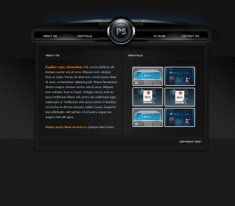](http://www.adobetutorialz.com/articles/2841/Professional-Modern-Web-Layout)

[Photography portfolio Design  

](http://www.adobetutorialz.com/articles/2931/1/Photography-portfolio)

[Professional header design for your website  

](http://www.tutorialshot.com/professional-header-design-for-your-website/)

[Glossy-Style Carbon Fibre Navigation Buttons  

](http://www.photoshopstar.com/web-graphics/glossy-style-carbon-fibre-navigation-set/)

[Photoshop Paper Texture from Scratch then Create a Grungy Web Design with it!  

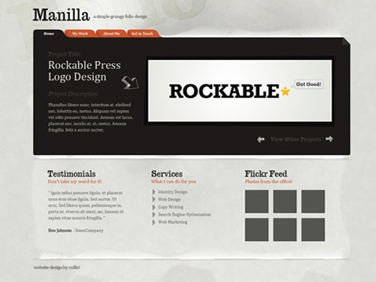](http://psdtuts.com/tutorials/interface-tutorials/photoshop-paper-texture-from-scratch-then-create-a-grungy-web-design-with-it/)

[Volkswagen Inspired Navigation  

](http://pshero.com/archives/volkswagen-inspired-navigation)

[Creating A Glossy 3D Button  

](http://magnusfx.com/graphics/creating-a-glossy-3d-button)

[Royal Interface – Design Tutorial  

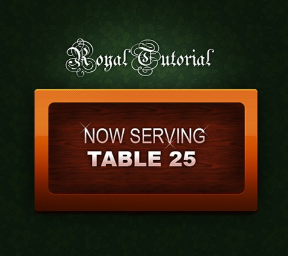](http://www.pstut.info/tutorials/royal-interface/)

[Design Watercolor Effect Menu  

](http://www.webdesignerwall.com/tutorials/design-watercolor-effect-menu/)

[Tutzor web 2.0 style design  

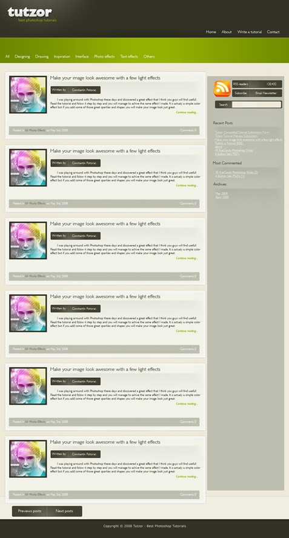](http://www.tutzor.com/index.php/2008/05/tutzor-web-20-style-re-design/)

[Black Website Design  

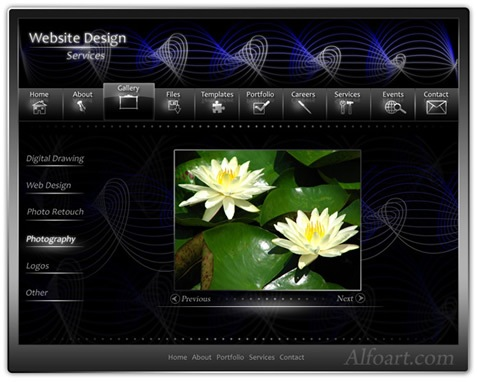](http://alfoart.com/black_design_1.html)

[How to Create a Simple & Sleek Web 2.0 Site Footer  

](http://psdtuts.com/interface-tutorials/how-to-create-a-simple-sleek-web-20-site-footer/)

[How to Create a Grunge Web Design in Photoshop  

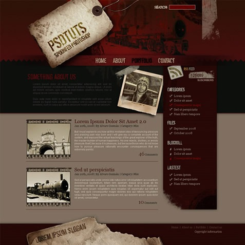](http://psdtuts.com/tutorials/interface-tutorials/how-to-create-a-grunge-web-design-in-photoshop/)

[Design a Professional Design Studio Web Template in Adobe Photoshop  

](http://www.cleardetails.com/2007/professionaldesignstudiowebtemplate2/)

[Corporate WordPress Style Layout  

](http://psdvibe.com/2009/01/20/corporate-wordpress-style-layout/)

[Create a Vibrant Modern Blog Design in Photoshop  

](http://www.blog.spoongraphics.co.uk/tutorials/create-a-vibrant-modern-blog-design-in-adobe-photoshop)

[Design a Simple Rounded Content Box in Photoshop  

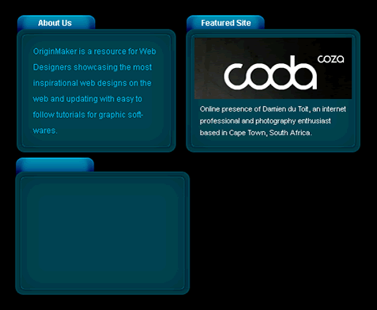](http://www.originmaker.com/2008/simple-content-box-photoshop-tutorial/)

[Design a Cartoon Grunge Web site Layout  

](http://psdtuts.com/interface-tutorials/design-a-cartoon-grunge-website-layout/)

[Design a Unique Grungy Website Layout  

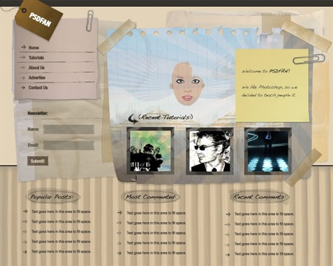](http://psdfan.com/designing/design-a-unique-grungy-website/)

[A Scrap Of Notebook Paper  

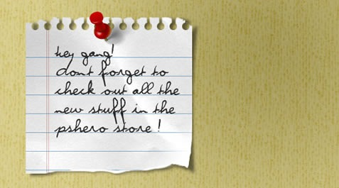](http://pshero.com/archives/a-scrap-of-notebook-paper)

[Creating A Glossy Navigation Bar  

](http://magnusfx.com/graphics/creating-a-glossy-navigation-bar)

[Making the ‘Clean Grunge’ Blog Design Photoshop tutorial  

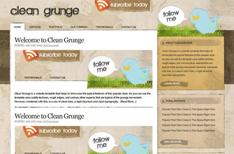](http://psdfan.com/tutorials/designing/making-the-clean-grunge-blog-design/)

[Sound System Studio Web Layout Photoshop tutorial  

](http://www.adobetutorialz.com/articles/2867/1/Sound-System-Studio-Web-Layout)

[Platinum Shiny, Glossy and Slick Web Design Photoshop tutorial  

](http://alfoart.com/platinum_webdesign_1.html)

[Design Studio Layout – Photoshop Tutorial  

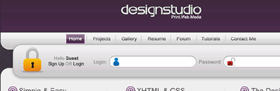](http://hv-designs.co.uk/2008/11/24/design-studio-layout-2/)

[How To Draw The Billings Application Icon  

](http://flyosity.com/tutorial/billings-icon-design-tutorial.php)

[Clean Vertical Navigation Interface in Photoshop  

](http://netcades.com/2008/07/21/clean-vertical-navigation-interface-in-photoshop/)

[Website Design Studio  

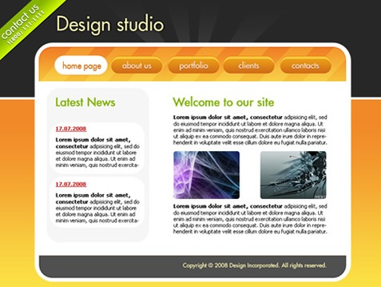](http://www.adobetutorialz.com/articles/2988/1/Website-Design-Studio)

[Creating A Professional Magazine Web Layout  

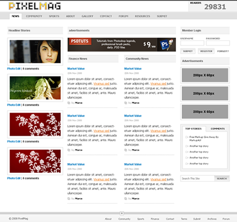](http://kailoon.com/creating-a-professional-magazine-web-layout/)

[Design Agency Layout Photoshop tutorial  

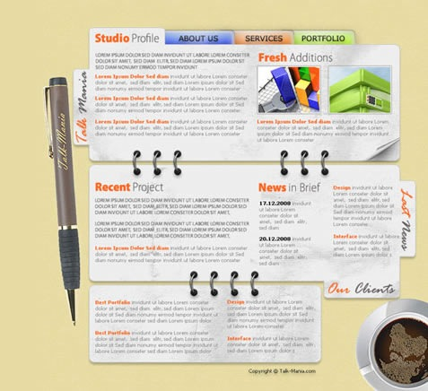](http://www.talk-mania.com/web-layouts/39171-design-agency-layout-tutorial-151-a.html)

[Modern Web Search Bar Photoshop tutorial  

](http://www.idotutorials.com/2008/08/21/modern-web-search-bar/)

[Design a Professional Design Studio Web Template in Adobe Photoshop  

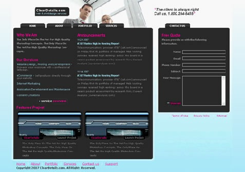](http://www.cleardetails.com/2007/professionaldesignstudiowebtemplate2/)

[Create a Professional Gaming Header Photoshop tutorial  

](http://www.idotutorials.com/2008/10/06/create-a-professional-gaming-header/)

[Carbon Fiber Layout Photoshop tutorial  

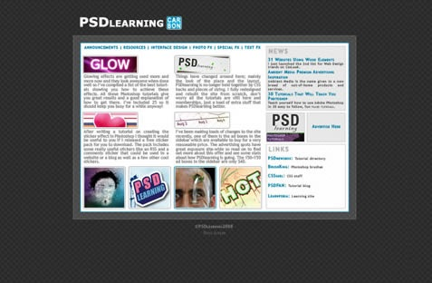](http://psdlearning.com/2008/08/carbon-fiber-layout/)

也欢迎你和大家分享这里没有列出来的。

文章：[来源](http://www.problogdesign.com/resources/35-awesome-user-interface-design-tutorials/)

**（转载本站文章请注明作者和出处 [酷 壳 – CoolShell](https://coolshell.cn/) ，请勿用于任何商业用途）**

### 相关文章

* [用户界面和用户体验的差别](https://coolshell.cn/articles/3142.html)
* [我做系统架构的一些原则](https://coolshell.cn/articles/21672.html)
* [API设计原则 – Qt官网的设计实践总结](https://coolshell.cn/articles/18024.html)
* [AWS 的 S3 故障回顾和思考](https://coolshell.cn/articles/17737.html)
* [从Gitlab误删除数据库想到的](https://coolshell.cn/articles/17680.html)
* [关于高可用的系统](https://coolshell.cn/articles/17459.html)
The post [35个强大的UI设计教程](https://coolshell.cn/articles/363.html) first appeared on [酷 壳 - CoolShell](https://coolshell.cn).