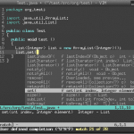

点击图片看大图

Eclipse 快捷键桌面  

  

vim 移动快捷键桌面

**（转载本站文章请注明作者和出处 [酷 壳 – CoolShell](https://coolshell.cn/) ，请勿用于任何商业用途）**

### 相关文章

* [Eclipse 和 Vim](https://coolshell.cn/articles/1837.html)
* [无插件Vim编程技巧](https://coolshell.cn/articles/11312.html)
* [应该知道的Linux技巧](https://coolshell.cn/articles/8883.html)
* [28个Unix/Linux的命令行神器](https://coolshell.cn/articles/7829.html)
* [游戏：VIM大冒险](https://coolshell.cn/articles/7166.html)
* [一些文章和各种资源](https://coolshell.cn/articles/5224.html)
The post [Eclipse和Vim快捷键桌面](https://coolshell.cn/articles/3181.html) first appeared on [酷 壳 - CoolShell](https://coolshell.cn).