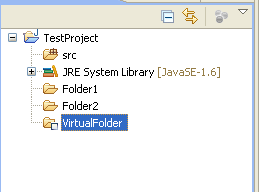
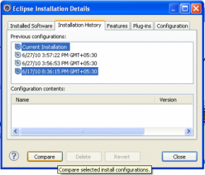
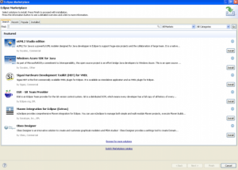

2010年6月23日 Eclipse 3.6 Helios 正式发布，对 Java 程序员来说有哪些新特性值得关注？

1、检查并报告是否有缺失的 @Override 注解，此功能仅对 Java 1.6 版本适用。在以前版本中，当我们为一个方法加上 @Override  注解，但是这个方法实际上并没有过载（override）任何父类的方法时，将会得到警告信息。在新版本中，如果我们忘记为一个过载方法加上 @Override 注解，同样也会得到警告信息。

2、变量视图中新增了一个列用于显示当前变量类型的实例数（Layout -> Select Column）。

3、Java 视图中的包名称可以用自定义的规则来显示（Window –> Preferences –> Java –> Appearance）。

4、用户可以选择在关闭 Eclipse 时不清除本地更改历史（local history），这样可以加快关闭的速度，但同时本地更改历史记录将会无限制地增大。

5、查看实现代码（Open Implementation）。此功能在 Navigate 菜单中能够找到，目前没有缺省的快捷键，用户可以为其自定义一个（Windows –> Preferences –> General –> Keys）。例如，用户可以查看一个抽象方法的具体实现，如果有多个实现， Eclipse 会显示一个弹出窗口。

6、虚拟文件夹（Virtual Folders）。用户可以在 workspace 中创建文件夹，这些文件夹只对 Eclipse 可见，对操作系统不可见。并且它们只能包含其他的虚拟文件夹和外部链接资源。

7、安装配置比较（Compare Configurations）。通过此功能用户可以查看那些组件在哪一时间被安装，还可以选择卸载无用的安装以节省空间。

8、提供了对 JSF 2.0，Apache Tomcat 7，和 Aapache CXF 的支持，新增了 JAX-RS project facet。

9、Eclipse 市场客户端（Eclipse Market Place Client）。在以前的版本中安装插件（plugins）一直都不能说是一件简单的事情，用户需要搜索相应的 update site URL。新版本引入了和 Apple 的应用商店类似的概念，用户可以在 Eclipse IDE 内搜索和安装插件了，此功能在 Help 菜单中可以找到。

*[文章来源一](http://www.techsagar.com/2010/07/10-new-features-which-i-liked-the-most-in-eclipse-helios-3-6-2/)，[文章来源二](http://rajakannappan.blogspot.com/2010/05/new-features-in-eclipse-36-helios.html)*

**（转载本站文章请注明作者和出处 [酷 壳 – CoolShell](https://coolshell.cn/) ，请勿用于任何商业用途）**

### 相关文章

* [Rust语言的编程范式](https://coolshell.cn/articles/20845.html)
* [程序员练级攻略（2018) 与我的专栏](https://coolshell.cn/articles/18360.html)
* [https://coolshell.cn/wp-content/plugins/wordpress-23-related-posts-plugin/static/thumbs/24.jpg](https://coolshell.cn/articles/11541.html)[面向GC的Java编程](https://coolshell.cn/articles/11541.html)
* [https://coolshell.cn/wp-content/plugins/wordpress-23-related-posts-plugin/static/thumbs/17.jpg](https://coolshell.cn/articles/11454.html)[从LongAdder看更高效的无锁实现](https://coolshell.cn/articles/11454.html)
* [Java中的CopyOnWrite容器](https://coolshell.cn/articles/11175.html)
* [无锁HashMap的原理与实现](https://coolshell.cn/articles/9703.html)
The post [Eclipse 3.6 （Helios）新特性](https://coolshell.cn/articles/2554.html) first appeared on [酷 壳 - CoolShell](https://coolshell.cn).