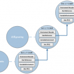

Javascript是一个类C的语言，他的面向对象的东西相对于C++/Java比较奇怪，但是其的确相当的强大，在 [Todd 同学](http://www.cnblogs.com/weidagang2046/)的“[对象的消息模型](https://coolshell.cn/articles/5202.html "对象的消息模型")”一文中我们已经可以看到一些端倪了。这两天有个前同事总在问我Javascript面向对象的东西，所以，索性写篇文章让他看去吧，这里这篇文章主要想从一个整体的角度来说明一下Javascript的面向对象的编程。（**成文比较仓促，应该有不准确或是有误的地方，请大家批评指正**）


另，这篇文章主要基于 [ECMAScript 5](http://www.ecma-international.org/publications/standards/Ecma-262.htm)， 旨在介绍新技术。关于兼容性的东西，请看最后一节。


#### 初探


我们知道Javascript中的变量定义基本如下：


```
var name = 'Chen Hao';;
var email = 'haoel(@)hotmail.com';
var website = 'https://coolshell.cn';
```

如果要用对象来写的话，就是下面这个样子：


```
var chenhao = {
    name :'Chen Hao',
    email : 'haoel(@)hotmail.com',
    website : 'https://coolshell.cn'
};
```

于是，我就可以这样访问：


```

//以成员的方式
chenhao.name;
chenhao.email;
chenhao.website;

//以hash map的方式
chenhao["name"];
chenhao["email"];
chenhao["website"];

```

关于函数，我们知道Javascript的函数是这样的：


```
var doSomething = function(){
   alert('Hello World.');
};
```

于是，我们可以这么干：


```

var sayHello = function(){
   var hello = "Hello, I'm "+ this.name
                + ", my email is: " + this.email
                + ", my website is: " + this.website;
   alert(hello);
};

//直接赋值，这里很像C/C++的函数指针
chenhao.Hello = sayHello;

chenhao.Hello();

```

相信这些东西都比较简单，大家都明白了。 可以看到javascript对象函数是直接声明，直接赋值，直接就用了。runtime的动态语言。


还有一种比较规范的写法是：


```

//我们可以看到， 其用function来做class。
var Person = function(name, email, website){
    this.name = name;
    this.email = email;
    this.website = website;

    this.sayHello = function(){
        var hello = "Hello, I'm "+ this.name  + ", \n" +
                    "my email is: " + this.email + ", \n" +
                    "my website is: " + this.website;
        alert(hello);
    };
};

var chenhao = new Person("Chen Hao", "haoel@hotmail.com",
                                     "https://coolshell.cn");
chenhao.sayHello(); 
```

顺便说一下，要删除对象的属性，很简单：


`delete chenhao['email']`


上面的这些例子，我们可以看到这样几点：


1. Javascript的数据和成员封装很简单。没有类完全是对象操作。纯动态！
2. Javascript function中的this指针很关键，如果没有的话，那就是局部变量或局部函数。
3. Javascript对象成员函数可以在使用时临时声明，并把一个全局函数直接赋过去就好了。
4. Javascript的成员函数可以在实例上进行修改，也就是说不同实例相同函数名的行为不一定一样。


#### 属性配置 – Object.defineProperty


先看下面的代码：


```

//创建对象
var chenhao = Object.create(null);

//设置一个属性
 Object.defineProperty( chenhao,
                'name', { value:  'Chen Hao',
                          writable:     true,
                          configurable: true,
                          enumerable:   true });

//设置多个属性
Object.defineProperties( chenhao,
    {
        'email'  : { value:  'haoel@hotmail.com',
                     writable:     true,
                     configurable: true,
                     enumerable:   true },
        'website': { value: 'https://coolshell.cn',
                     writable:     true,
                     configurable: true,
                     enumerable:   true }
    }
);

```

下面就说说这些属性配置是什么意思。


* writable：这个属性的值是否可以改。
* configurable：这个属性的配置是否可以改。
* enumerable：这个属性是否能在for…in循环中遍历出来或在Object.keys中列举出来。
* value：属性值。
* get()/set(\_value)：get和set访问器。


#### Get/Set 访问器


关于get/set访问器，它的意思就是用get/set来取代value（其不能和value一起使用），示例如下：


```
var  age = 0;
Object.defineProperty( chenhao,
            'age', {
                      get: function() {return age+1;},
                      set: function(value) {age = value;}
                      enumerable : true,
                      configurable : true
                    }
);
chenhao.age = 100; //调用set
alert(chenhao.age); //调用get 输出101（get中+1了）;

```

我们再看一个更为实用的例子——利用已有的属性(age)通过get和set构造新的属性(birth\_year)：


```

Object.defineProperty( chenhao,
            'birth_year',
            {
                get: function() {
                    var d = new Date();
                    var y = d.getFullYear();
                    return ( y - this.age );
                },
                set: function(year) {
                    var d = new Date();
                    var y = d.getFullYear();
                    this.age = y - year;
                }
            }
);

alert(chenhao.birth_year);
chenhao.birth_year = 2000;
alert(chenhao.age);

```

这样做好像有点麻烦，你说，我为什么不写成下面这个样子：


```

var chenhao = {
    name: "Chen Hao",
    email: "haoel@hotmail.com",
    website: "https://coolshell.cn",
    age: 100,
    get birth_year() {
        var d = new Date();
        var y = d.getFullYear();
        return ( y - this.age );
    },
    set birth_year(year) {
        var d = new Date();
        var y = d.getFullYear();
        this.age = y - year;
    }

};
alert(chenhao.birth_year);
chenhao.birth_year = 2000;
alert(chenhao.age);

```

是的，你的确可以这样的，不过通过defineProperty()你可以干这些事：  

1）设置如 writable，configurable，enumerable 等这类的属性配置。  

2）动态地为一个对象加属性。比如：一些HTML的DOM对像。


#### 查看对象属性配置


如果查看并管理对象的这些配置，下面有个程序可以输出对象的属性和配置等东西：


```
//列出对象的属性.
function listProperties(obj)
{
    var newLine = "<br />";
    var names = Object.getOwnPropertyNames(obj);
    for (var i = 0; i < names.length; i++) {
        var prop = names[i];
        document.write(prop + newLine);

        // 列出对象的属性配置（descriptor）动用getOwnPropertyDescriptor函数。
        var descriptor = Object.getOwnPropertyDescriptor(obj, prop);
        for (var attr in descriptor) {
            document.write("..." + attr + ': ' + descriptor[attr]);
            document.write(newLine);
        }
        document.write(newLine);
    }
}

listProperties(chenhao);
```

#### call，apply， bind 和 this


关于Javascript的this指针，和C++/Java很类似。 我们来看个示例：（这个示例很简单了，我就不多说了）


```
function print(text){
    document.write(this.value + ' - ' + text+ '<br>');
}

var a = {value: 10, print : print};
var b = {value: 20, print : print};

print('hello');// this => global, output "undefined - hello"

a.print('a');// this => a, output "10 - a"
b.print('b'); // this => b, output "20 - b"

a['print']('a'); // this => a, output "10 - a"

```

我们再来看看call 和 apply，这两个函数的差别就是参数的样子不一样，另一个就是性能不一样，apply的性能要差很多。（关于性能，可到 [JSPerf](http://jsperf.com/) 上去跑跑看看）


```
print.call(a, 'a'); // this => a, output "10 - a"
print.call(b, 'b'); // this => b, output "20 - b"

print.apply(a, ['a']); // this => a, output "10 - a"
print.apply(b, ['b']); // this => b, output "20 - b"
```

但是在bind后，this指针，可能会有不一样，但是因为Javascript是动态的。如下面的示例


```
var p = print.bind(a);
p('a');             // this => a, output "10 - a"
p.call(b, 'b');     // this => a, output "10 - b"
p.apply(b, ['b']);  // this => a, output "10 - b"
```

#### 继承 和 重载


通过上面的那些示例，我们可以通过Object.create()来实际继承，请看下面的代码，Student继承于Object。


```

var Person = Object.create(null);

Object.defineProperties
(
    Person,
    {
        'name'  : {  value: 'Chen Hao'},
        'email'  : { value : 'haoel@hotmail.com'},
        'website': { value: 'https://coolshell.cn'}
    }
);

Person.sayHello = function () {
    var hello = "<p>Hello, I am "+ this.name  + ", <br>" +
                "my email is: " + this.email + ", <br>" +
                "my website is: " + this.website;
    document.write(hello + "<br>");
}

var Student = Object.create(Person);
Student.no = "1234567"; //学号
Student.dept = "Computer Science"; //系

//使用Person的属性
document.write(Student.name + ' ' + Student.email + ' ' + Student.website +'<br>');

//使用Person的方法
Student.sayHello();

//重载SayHello方法
Student.sayHello = function (person) {
    var hello = "<p>Hello, I am "+ this.name  + ", <br>" +
                "my email is: " + this.email + ", <br>" +
                "my website is: " + this.website + ", <br>" +
                "my student no is: " + this. no + ", <br>" +
                "my departent is: " + this. dept;
    document.write(hello + '<br>');
}
//再次调用
Student.sayHello();

//查看Student的属性（只有 no 、 dept 和 重载了的sayHello）
document.write('<p>' + Object.keys(Student) + '<br>');

```

通用上面这个示例，我们可以看到，Person里的属性并没有被真正复制到了Student中来，但是我们可以去存取。这是因为Javascript用委托实现了这一机制。其实，这就是Prototype，Person是Student的Prototype。


当我们的代码需要一个属性的时候，Javascript的引擎会先看当前的这个对象中是否有这个属性，如果没有的话，就会查找他的Prototype对象是否有这个属性，一直继续下去，直到找到或是直到没有Prototype对象。


为了证明这个事，我们可以使用Object.getPrototypeOf()来检验一下：


```
Student.name = 'aaa';

//输出 aaa
document.write('<p>' + Student.name + '</p>');

//输出 Chen Hao
document.write('<p>' +Object.getPrototypeOf(Student).name + '</p>');
```

于是，你还可以在子对象的函数里调用父对象的函数，就好像C++里的 Base::func() 一样。于是，我们重载hello的方法就可以使用父类的代码了，如下所示：


```
//新版的重载SayHello方法
Student.sayHello = function (person) {
    Object.getPrototypeOf(this).sayHello.call(this);
    var hello = "my student no is: " + this. no + ", <br>" +
                "my departent is: " + this. dept;
    document.write(hello + '<br>');
}
```

这个很强大吧。


#### 组合


上面的那个东西还不能满足我们的要求，我们可能希望这些对象能真正的组合起来。为什么要组合？因为我们都知道是这是OO设计的最重要的东西。不过，这对于Javascript来并没有支持得特别好，不好我们依然可以搞定个事。


首先，我们需要定义一个Composition的函数：（target是作用于是对象，source是源对象），下面这个代码还是很简单的，就是把source里的属性一个一个拿出来然后定义到target中。


```

function Composition(target, source)
{
    var desc  = Object.getOwnPropertyDescriptor;
    var prop  = Object.getOwnPropertyNames;
    var def_prop = Object.defineProperty;

    prop(source).forEach(
        function(key) {
            def_prop(target, key, desc(source, key))
        }
    )
    return target;
}

```

有了这个函数以后，我们就可以这来玩了：


```

//艺术家
var Artist = Object.create(null);
Artist.sing = function() {
    return this.name + ' starts singing...';
}
Artist.paint = function() {
    return this.name + ' starts painting...';
}

//运动员
var Sporter = Object.create(null);
Sporter.run = function() {
    return this.name + ' starts running...';
}
Sporter.swim = function() {
    return this.name + ' starts swimming...';
}

Composition(Person, Artist);
document.write(Person.sing() + '<br>');
document.write(Person.paint() + '<br>');

Composition(Person, Sporter);
document.write(Person.run() + '<br>');
document.write(Person.swim() + '<br>');

//看看 Person中有什么？（输出：sayHello,sing,paint,swim,run）
document.write('<p>' + Object.keys(Person) + '<br>');

```

#### Prototype 和 继承


我们先来说说Prototype。我们先看下面的例程，这个例程不需要解释吧，很像C语言里的函数指针，在C语言里这样的东西见得多了。


```
var plus = function(x,y){
    document.write( x + ' + ' + y + ' = ' + (x+y) + '<br>');
    return x + y;
};

var minus = function(x,y){
    document.write(x + ' - ' + y + ' = ' + (x-y) + '<br>');
    return x - y;
};

var operations = {
    '+': plus,
    '-': minus
};

var calculate = function(x, y, operation){
    return operations[operation](x, y);
};

calculate(12, 4, '+');
calculate(24, 3, '-');

```

那么，我们能不能把这些东西封装起来呢，我们需要使用prototype。看下面的示例：


```
var Cal = function(x, y){
    this.x = x;
    this.y = y;
}

Cal.prototype.operations = {
    '+': function(x, y) { return x+y;},
    '-': function(x, y) { return x-y;}
};

Cal.prototype.calculate = function(operation){
    return this.operations[operation](this.x, this.y);
};

var c = new Cal(4, 5);

c.calculate('+');
c.calculate('-');
```

这就是prototype的用法，prototype 是javascript这个语言中最重要的内容。网上有太多的文章介始这个东西了。说白了，prototype就是对一对象进行扩展，其特点在于通过“复制”一个已经存在的实例来返回新的实例,而不是新建实例。被复制的实例就是我们所称的“原型”，这个原型是可定制的（当然，这里没有真正的复制，实际只是委托）。上面的这个例子中，我们扩展了实例Cal，让其有了一个operations的属性和一个calculate的方法。


这样，我们可以通过这一特性来实现继承。还记得我们最最前面的那个Person吧， 下面的示例是创建一个Student来继承Person。


```

function Person(name, email, website){
    this.name = name;
    this.email = email;
    this.website = website;
};

Person.prototype.sayHello = function(){
    var hello = "Hello, I am "+ this.name  + ", <br>" +
                "my email is: " + this.email + ", <br>" +
                "my website is: " + this.website;
    return hello;
};

function Student(name, email, website, no, dept){
    var proto = Object.getPrototypeOf;
    proto(Student.prototype).constructor.call(this, name, email, website);
    this.no = no;
    this.dept = dept;
}

// 继承prototype
Student.prototype = Object.create(Person.prototype);

//重置构造函数
Student.prototype.constructor = Student;

//重载sayHello()
Student.prototype.sayHello = function(){
    var proto = Object.getPrototypeOf;
    var hello = proto(Student.prototype).sayHello.call(this) + '<br>';
    hello += "my student no is: " + this. no + ", <br>" +
             "my departent is: " + this. dept;
    return hello;
};

var me = new Student(
    "Chen Hao",
    "haoel@hotmail.com",
    "https://coolshell.cn",
    "12345678",
    "Computer Science"
);
document.write(me.sayHello());
```

#### 兼容性


上面的这些代码并不一定能在所有的浏览器下都能运行，因为上面这些代码遵循 ECMAScript 5 的规范，关于ECMAScript 5 的浏览器兼容列表，你可以看这里“[ES5浏览器兼容表](http://kangax.github.com/es5-compat-table/)”。


本文中的所有代码都在Chrome最新版中测试过了。


下面是一些函数，可以用在不兼容ES5的浏览器中：


##### Object.create()函数


```
function clone(proto) {
    function Dummy() { }

    Dummy.prototype             = proto;
    Dummy.prototype.constructor = Dummy;

    return new Dummy(); //等价于Object.create(Person);
}

var me = clone(Person);

```

##### defineProperty()函数


```
function defineProperty(target, key, descriptor) {
    if (descriptor.value){
        target[key] = descriptor.value;
    }else {
        descriptor.get && target.__defineGetter__(key, descriptor.get);
        descriptor.set && target.__defineSetter__(key, descriptor.set);
    }

    return target
}
```

##### keys()函数


```
function keys(object) { var result, key
    result = [];
    for (key in object){
        if (object.hasOwnProperty(key))  result.push(key)
    }

    return result;
}
```

##### Object.getPrototypeOf() 函数


```
function proto(object) {
    return !object?                null
         : '__proto__' in object?  object.__proto__
         : /* not exposed? */      object.constructor.prototype
}
```

##### bind 函数


```
var slice = [].slice

function bind(fn, bound_this) { var bound_args
    bound_args = slice.call(arguments, 2)
    return function() { var args
        args = bound_args.concat(slice.call(arguments))
        return fn.apply(bound_this, args) }
}

```

#### 参考


* W3CSchool
* MDN (Mozilla Developer Network)
* MSDN (Microsoft Software Development Network)
* [Understanding Javascript OOP](http://killdream.github.com/blog/2011/10/understanding-javascript-oop/).


**（转载时请注明作者和出处，请勿用于任何商业用途）**


**（转载本站文章请注明作者和出处 [酷 壳 – CoolShell](https://coolshell.cn/) ，请勿用于任何商业用途）**


### 相关文章

* [](https://coolshell.cn/articles/6731.html)[理解Javascript的闭包](https://coolshell.cn/articles/6731.html)
* [](https://coolshell.cn/articles/6668.html)[再谈javascript面向对象编程](https://coolshell.cn/articles/6668.html)
* [https://coolshell.cn/wp-content/plugins/wordpress-23-related-posts-plugin/static/thumbs/14.jpg](https://coolshell.cn/articles/5202.html)[对象的消息模型](https://coolshell.cn/articles/5202.html)
* [](https://coolshell.cn/articles/18360.html)[程序员练级攻略（2018) 与我的专栏](https://coolshell.cn/articles/18360.html)
* [](https://coolshell.cn/articles/17634.html)[Chrome开发者工具的小技巧](https://coolshell.cn/articles/17634.html)
* [](https://coolshell.cn/articles/17524.html)[如何读懂并写出装逼的函数式代码](https://coolshell.cn/articles/17524.html)
The post [Javascript 面向对象编程](https://coolshell.cn/articles/6441.html) first appeared on [酷 壳 - CoolShell](https://coolshell.cn).